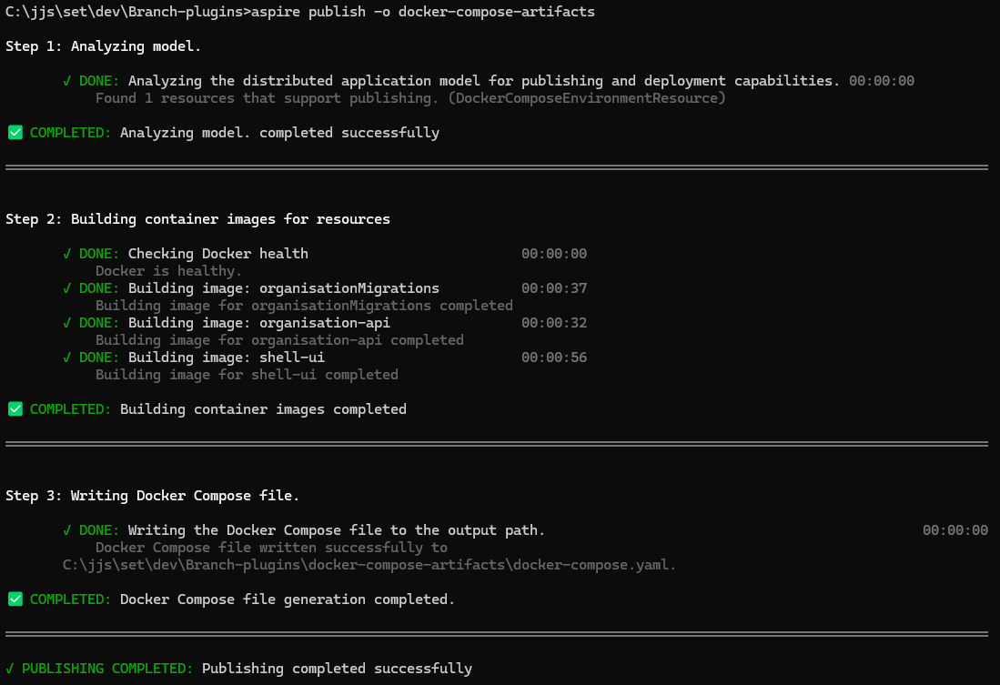
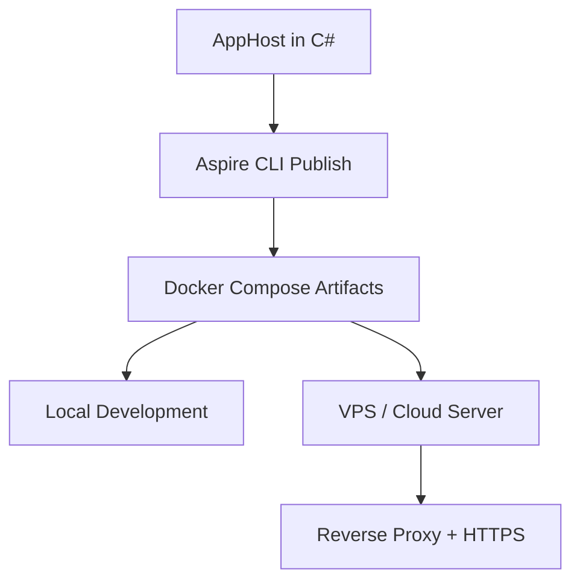

# Using .NET Aspire With the Docker Publisher

**.NET Aspire** is one of the most exciting additions to the .NET ecosystem in years. It delivers a modern, cloud-native development experience with strong defaults, seamless integration, and a focus on developer productivity.

A highly requested feature is the ability to publish directly to **Docker Compose**. With the latest preview, this feature is available, and in this guide, I’ll show you how it works.

We’ll walk through using **Aspire’s Docker Publisher** to spin up a demo app that includes:

- A SQL Server database
- A migration service
- A minimal .NET API
- A Shell UI

Everything runs under Docker Compose, and Aspire generates the required configuration directly from C# code. We’ll cover setup, what happens behind the scenes, and how to take this configuration to a VPS or cloud host.

<!-- more -->

## The Shell App & Organisation Plugin

The demo app is a typical plugin for the Shell app to highlight how **Aspire** handles service orchestration:

- **SQL Server** – used for data storage  
- **API project** – a minimal Web API  
- **Shell** – runs the UI  

Normally, you’d connect these services manually, manage configuration files, define environment variables, and write a `docker-compose.yml` file from scratch.  

With **Aspire**, all of this is declared in C# inside the **AppHost project**:

```csharp
var builder = DistributedApplication.CreateBuilder(args);

// Enables Docker publisher
builder.AddDockerComposeEnvironment("branch-environment");

var sqlServer = builder
    .AddSqlServer("branch-sql-server", builder.CreateResourceBuilder(new ParameterResource("password", _ => "<My-1st-strong password>")))
    .WithDataVolume("branch-sql-server-volume")
    .WithLifetime(ContainerLifetime.Persistent);

var organisationDb = sqlServer.AddDatabase("OrganisationDB", "Organisations");
var organisationMigrations = builder.AddProject<Projects.JJs_OrganisationManagement_MigrationService>("organisationMigrations")
    .WithParentRelationship(organisationDb).WithReference(organisationDb).WaitFor(organisationDb);

var organisationApi = builder.AddProject<Projects.JJs_OrganisationManagement_Api>("organisation-api")
    .WithReference(organisationDb).WaitForCompletion(organisationMigrations)
    .WithSwagger().WithReDoc().WithScalar();

builder.AddProject<Projects.Shell>("shell-ui")
    WithReference(organisationApi).WaitFor(organisationApi);

builder.Build().Run();
```

This configuration provides a development environment where Aspire runs SQL Server in a container and wires up your API automatically.

The key call here is `AddDockerComposeEnvironment`, which enables the Docker publisher. This feature is available in the `Aspire.Hosting.Docker` NuGet package (currently in preview):

```bash
Install-Package Aspire.Hosting.Docker -Version 9.4.2-preview.1.25428.12
```

## Installing the Aspire CLI

To publish your app to Docker Compose, install the **Aspire CLI**:

```bash
dotnet tool install --global aspire.cli --prerelease
```

Then `publish` your app:

```bash
aspire publish -o docker-compose-artifacts
```

This command scans your solution for **Aspire** projects and generates both a `docker-compose.yml` and a `.env` file in the specified output directory `docker-compose-artifacts`.



## The Docker Compose File

Let's examine the result:

```yaml
services:
  branch-environment-dashboard:
    image: "mcr.microsoft.com/dotnet/nightly/aspire-dashboard:latest"
    expose:
      - "18888"
      - "18889"
    networks:
      - "aspire"
    restart: "always"
  branch-sql-server:
    image: "mcr.microsoft.com/mssql/server:2022-latest"
    environment:
      ACCEPT_EULA: "Y"
      MSSQL_SA_PASSWORD: "${PASSWORD}"
    expose:
      - "1433"
    volumes:
      - type: "volume"
        target: "/var/opt/mssql"
        source: "branch-sql-server-volume"
        read_only: false
    networks:
      - "aspire"
  organisationmigrations:
    image: "${ORGANISATIONMIGRATIONS_IMAGE}"
    environment:
      OTEL_DOTNET_EXPERIMENTAL_OTLP_EMIT_EXCEPTION_LOG_ATTRIBUTES: "true"
      OTEL_DOTNET_EXPERIMENTAL_OTLP_EMIT_EVENT_LOG_ATTRIBUTES: "true"
      OTEL_DOTNET_EXPERIMENTAL_OTLP_RETRY: "in_memory"
      ConnectionStrings__OrganisationDB: "Server=branch-sql-server,1433;User ID=sa;Password=${PASSWORD};TrustServerCertificate=true;Initial Catalog=Organisations"
      OTEL_EXPORTER_OTLP_ENDPOINT: "http://branch-environment-dashboard:18889"
      OTEL_EXPORTER_OTLP_PROTOCOL: "grpc"
      OTEL_SERVICE_NAME: "organisationMigrations"
    depends_on:
      branch-sql-server:
        condition: "service_started"
    networks:
      - "aspire"
  organisation-api:
    image: "${ORGANISATION_API_IMAGE}"
    environment:
      OTEL_DOTNET_EXPERIMENTAL_OTLP_EMIT_EXCEPTION_LOG_ATTRIBUTES: "true"
      OTEL_DOTNET_EXPERIMENTAL_OTLP_EMIT_EVENT_LOG_ATTRIBUTES: "true"
      OTEL_DOTNET_EXPERIMENTAL_OTLP_RETRY: "in_memory"
      ASPNETCORE_FORWARDEDHEADERS_ENABLED: "true"
      HTTP_PORTS: "${ORGANISATION_API_PORT}"
      ConnectionStrings__OrganisationDB: "Server=branch-sql-server,1433;User ID=sa;Password=${PASSWORD};TrustServerCertificate=true;Initial Catalog=Organisations"
      OTEL_EXPORTER_OTLP_ENDPOINT: "http://branch-environment-dashboard:18889"
      OTEL_EXPORTER_OTLP_PROTOCOL: "grpc"
      OTEL_SERVICE_NAME: "organisation-api"
    expose:
      - "${ORGANISATION_API_PORT}"
    depends_on:
      organisationmigrations:
        condition: "service_completed_successfully"
    networks:
      - "aspire"
  shell-ui:
    image: "${SHELL_UI_IMAGE}"
    environment:
      OTEL_DOTNET_EXPERIMENTAL_OTLP_EMIT_EXCEPTION_LOG_ATTRIBUTES: "true"
      OTEL_DOTNET_EXPERIMENTAL_OTLP_EMIT_EVENT_LOG_ATTRIBUTES: "true"
      OTEL_DOTNET_EXPERIMENTAL_OTLP_RETRY: "in_memory"
      ASPNETCORE_FORWARDEDHEADERS_ENABLED: "true"
      HTTP_PORTS: "${SHELL_UI_PORT}"
      OTEL_EXPORTER_OTLP_ENDPOINT: "http://branch-environment-dashboard:18889"
      OTEL_EXPORTER_OTLP_PROTOCOL: "grpc"
      OTEL_SERVICE_NAME: "shell-ui"
    expose:
      - "${SHELL_UI_PORT}"
    depends_on:
      organisation-api:
        condition: "service_started"
    networks:
      - "aspire"
networks:
  aspire:
    driver: "bridge"
volumes:
  branch-sql-server-volume:
    driver: "local"
```

This docker-compose file is generated from the C# code we added to the `AppHost/Program.cs` file. It defines all services, images, environment variables, ports, and dependencies..

## The `.env` file

**Aspire** also generates an `.env` file with configuration values:

```text
# Default container port for organisation-api
ORGANISATION_API_PORT=8080

# Default container port for shell-ui
SHELL_UI_PORT=8080

# Parameter password
PASSWORD=<My-1st-strong password>

# Container image name for organisationMigrations
ORGANISATIONMIGRATIONS_IMAGE=organisationMigrations:latest

# Container image name for organisation-api
ORGANISATION_API_IMAGE=organisation-api:latest

# Container image name for shell-ui
SHELL_UI_IMAGE=shell-ui:latest
```

This file contains:

- Default container ports
- Database credentials
- Container image names

Update placeholders (such as passwords) with real values. For the images, you can build and tag them yourself, or pull from a registry.

## Publishing and Running on a Virtual Private Server (VPS)

**Aspire** doesn't deploy the app for you, but it gives you everything you need.

Once the Compose file is ready, deployment to a VPS is straightforward:

1. Copy the artifacts to your server using (`scp` or `git`).
2. Remote into the VPS.
3. Run `docker compose up -d` inside the artifact directory.

Make sure Docker and Docker Compose are installed on the server.

For external access, configure a reverse proxy (e.g., YARP, NGINX, or Caddy) and secure endpoints with HTTPS.

## Wrapping Up

Using **.NET Aspire** with Docker Compose creates a smooth developer experience and simplifies full-stack app deployment.

- Define everything in C#
- Test locally
- Publish with a single command

No need to hand-craft Compose files or juggle infrastructure manually. **Aspire** keeps you cloud-agnostic, so you can move between environments with ease.

I’m genuinely excited about where this is heading — the future of cloud-native development in .NET looks bright with **Aspire**.

## Next Steps

If you’d like to take this further, here are some ideas:

- 🔗 Explore the [official .NET Aspire documentation](https://learn.microsoft.com/dotnet/aspire) for the latest updates.
- ⚙️ Integrate **Aspire publishing** into a CI/CD pipeline (e.g., GitHub Actions, Azure DevOps, or GitLab).
- ☁️ Try deploying your Compose setup to a managed environment like Azure Container Apps, AWS ECS, or Fly.io.
- 🔒 Add a reverse proxy and HTTPS support with **YARP**, **NGINX**, or **Traefik**.
- 📦 Experiment with other services (Redis, RabbitMQ, PostgreSQL) by declaring them in C#.

## Visual Overview

Here’s a simple diagram of the workflow from Aspire to deployment:


This illustrates how **Aspire** turns your C# configuration into Docker artifacts that can be run locally or deployed remotely.
