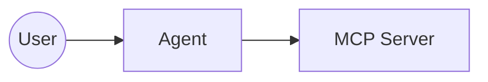
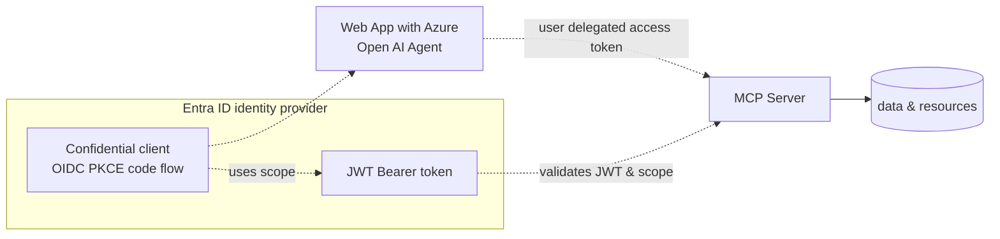

---
title: Secure MCP server using Entra
date: 2025-09-25
categories: [programming, ai]
tags: [code]
---

# Secure MCP Server using Entra

This article demonstrates how to implement a secure Model Context Protocol (MCP) server using OAuth 2.0 and Microsoft Entra ID. The implementation leverages `ASP.NET Core` for the MCP server infrastructure and integrates Microsoft Entra ID for robust API security. Additionally, we'll explore how to build an MCP client using `ASP.NET Core` with `Azure OpenAI` and `Semantic Kernel` to enable secure agent interactions.

Code: https://github.com/allann/ModellerMcp.Security

## Prerequisites

Before implementing the secure MCP server solution, ensure you have the following environment and tools prepared:

**Development Environment:**
- `.NET 8.0 SDK` or later installed
- `Visual Studio 2022` or `Visual Studio Code` with C# extension
- `Azure CLI` installed and configured
- `Git` for source control

**Azure Services:**
- Active `Azure subscription` with appropriate permissions
- `Microsoft Entra ID` tenant with administrative access
- `Azure OpenAI` service provisioned with model deployments
- Ability to create and configure `App Registrations` in Entra ID

**Required Permissions:**
- `Application Developer` or `Application Administrator` role in Entra ID
- `Contributor` access to the Azure subscription for resource creation
- Permission to configure `API permissions` and `authentication flows`

**Local Development Setup:**
- Configure your development environment with the necessary NuGet package sources
- Ensure your local machine can access Azure services (network connectivity)
- Set up `User Secrets` for local development configuration
- Install the `Microsoft.Identity.Web` and `ModelContextProtocol.AspNetCore` NuGet packages

## Setup

The solution architecture consists of two distinct `ASP.NET Core` services that work together to provide secure MCP functionality. `Azure OpenAI` powers the agent intelligence and language model processing capabilities. The MCP server leverages the `ModelContextProtocol.AspNetCore` NuGet package alongside `Microsoft.Identity.Web` to establish a secure API foundation. The client implementation resides within an `ASP.NET Core` web application that handles authentication through Microsoft Entra ID using the `Microsoft.Identity.Web` package, while `Azure OpenAI` processes user prompts and agent interactions.



Examining the detailed architecture reveals how Entra ID and `Azure OpenAI` can be seamlessly integrated using two application registrations. The web application requires the capability to utilize either a client secret or client assertion, enabling it to leverage the confidential client flow for secure authentication. Scope validation ensures that only delegated access tokens specifically intended for the MCP server are accepted, maintaining strict access control.



## Implement a secure MCP server

Implementing an MCP server in .NET becomes straightforward when leveraging the `ModelContextProtocol.AspNetCore` NuGet package. This package provides essential extension methods, requiring you to define only the specific MCP tools that your server will expose. Since the MCP server functions as an API, it can be secured using delegated access tokens from Microsoft Entra ID. Given that server users are identities associated with client applications, the server must exclusively accept delegated access tokens. This security requirement is enforced by validating the scope (`scp`) claim alongside all recommended JWT OAuth validations. The `Microsoft.Identity.Web` NuGet package facilitates this implementation through the `AddMicrosoftIdentityWebApiAuthentication` method.

```csharp
builder.Services.AddMicrosoftIdentityWebApiAuthentication(builder.Configuration);
var httpMcpServerUrl = builder.Configuration["HttpMcpServerUrl"];

builder.Services.AddAuthentication()
    .AddMcp(options =>
    {
        options.ResourceMetadata = new()
        {
            Resource = new Uri(httpMcpServerUrl),
            ResourceDocumentation = new Uri("https://mcpoauthsecurity-hag0drckepathyb6.westeurope-01.azurewebsites.net/health"),
            //AuthorizationServers = { new Uri(inMemoryOAuthServerUrl) },
            ScopesSupported = ["mcp:tools"],
        };
    });

builder.Services.AddAuthorization();

builder.Services
    .AddMcpServer()
    .WithHttpTransport()
    .WithTools<RandomNumberTools>()
    .WithTools<DateTools>()
    .WithTools<WeatherTools>();

// Add CORS for HTTP transport support in browsers
builder.Services.AddCors(options =>
{
    options.AddDefaultPolicy(policy =>
    {
        policy.AllowAnyOrigin()
            .AllowAnyHeader()
            .AllowAnyMethod();
    });
});

builder.Services.AddHttpClient();

// change to scp or scope if not using magic namespaces from MS
// The scope must be validate as we want to force only delegated access tokens
// The scope is requires to only allow access tokens intended for this API
builder.Services.AddAuthorizationBuilder()
    .AddPolicy("mcp_tools", policy =>
        policy.RequireClaim("http://schemas.microsoft.com/identity/claims/scope", "mcp:tools"));
```

The authentication and authorization middleware integrates seamlessly with the MCP endpoint, requiring a valid Microsoft Entra ID token containing the necessary scope claim and value for service access. The “`"mcp_tools"`” policy enforces this security requirement, ensuring only properly authorized requests can utilize the service.

```csharp
// Configure the HTTP request pipeline.
app.UseHttpsRedirection();

// Enable CORS
app.UseCors();

app.MapGet("/health", () => $"Secure MCP server running deployed: UTC: {DateTime.UtcNow}, use /mcp path to use the tools");

app.UseAuthentication();
app.UseAuthorization();

app.MapMcp("/mcp").RequireAuthorization("mcp_tools");
```

## Implement a MCP client in ASP.NET Core

With our secure MCP server established, we can now develop a client application to consume the API. The client implementation utilizes `ASP.NET Core` paired with `Azure OpenAI` for intelligent agent capabilities. Security is maintained through `OpenID Connect` code flow with `PKCE` (Proof Key for Code Exchange), leveraging Microsoft Entra ID as the OIDC server. The `Microsoft.Identity.Web` NuGet package provides the `AddMicrosoftIdentityWebApp` extension method to streamline this integration. The core agent functionality, powered by `Azure OpenAI`, is encapsulated within the `ChatService` class.

```csharp
var builder = WebApplication.CreateBuilder(args);

builder.Services.AddAuthentication(OpenIdConnectDefaults.AuthenticationScheme)
    .AddMicrosoftIdentityWebApp(builder.Configuration.GetSection("AzureAd"))
    .EnableTokenAcquisitionToCallDownstreamApi(["api://96b0f495-3b65-4c8f-a0c6-c3767c3365ed/mcp:tools"])
    .AddInMemoryTokenCaches();

builder.Services.AddAuthorization(options =>
{
    // By default, all incoming requests will be authorized according to the default policy.
    options.FallbackPolicy = options.DefaultPolicy;
});

builder.Services.AddRazorPages()
    .AddMicrosoftIdentityUI();

builder.Services.AddScoped<ChatService>();

var app = builder.Build();

// Configure the HTTP request pipeline.
if (!app.Environment.IsDevelopment())
{
    app.UseExceptionHandler("/Error");
    // The default HSTS value is 30 days. You may want to change this for production scenarios, see https://aka.ms/aspnetcore-hsts.
    app.UseHsts();
}

app.UseHttpsRedirection();

app.UseRouting();

app.UseAuthorization();

app.MapStaticAssets();
app.MapRazorPages()
    .WithStaticAssets();
app.MapControllers();

app.Run();
```

Upon successful user authentication, the system returns an `id_token` for both the user and application. The authenticated identity can then request a delegated access token specifically for the MCP server by specifying the required API scope. This design ensures that our MCP server exclusively accepts delegated access tokens, maintaining strict security boundaries.

### ChatService

The `ChatService` implementation leverages the `Microsoft.SemanticKernel` NuGet package to orchestrate agent logic through `Azure OpenAI` integration. Communication with the MCP server occurs via an `HttpClient` configured with the delegated access token as a `Bearer` token. This architecture enables seamless invocation of MCP server functions within the agent's decision-making process.

```csharp
public class ChatService
{
    private readonly IConfiguration _configuration;
    private readonly ElicitationCoordinator _elicitationCoordinator;
    private Kernel _kernel;
    private IMcpClient _mcpClient = null!;
    private bool _initialized;
    private ApprovalMode _mode = ApprovalMode.Manual;
    private readonly ITokenAcquisition _tokenAcquisition;

    private PromptingService? _promptingService;

    public ChatService(IConfiguration configuration, ElicitationCoordinator elicitationCoordinator, ITokenAcquisition tokenAcquisition)
    {
        _configuration = configuration;
        _elicitationCoordinator = elicitationCoordinator;
        var config = new ConfigurationBuilder()
            .AddUserSecrets<Program>()
            .Build();
        _kernel = SemanticKernelHelper.GetKernel(config);
        _tokenAcquisition = tokenAcquisition;
    }
 
    public void SetMode(ApprovalMode mode)
    {
        if (_mode != mode)
        {
            _initialized = false;
            _mode = mode;
        }
    }
 
    public async Task EnsureSetupAsync(IHttpClientFactory clientFactory)
    {
        if (_initialized) return;
 
        var accessToken = await _tokenAcquisition
            .GetAccessTokenForUserAsync([_configuration["McpScope"]!]);
 
        _mcpClient = await McpClientFactory.CreateAsync(CreateMcpTransport(clientFactory, accessToken), GetMcpOptions());
        await _kernel.ImportMcpClientToolsAsync(_mcpClient);
 
        _promptingService = new PromptingService(_kernel, autoInvoke: _mode == ApprovalMode.Elicitation);
        _initialized = true;
    }
 
    private McpClientOptions? GetMcpOptions()
    {
        return _mode == ApprovalMode.Elicitation ? new McpClientOptions
        {
            ClientInfo = new() { Name = "WebElicitationClient", Version = "1.0.0" },
            Capabilities = new() { Elicitation = new() { ElicitationHandler = HandleElicitationAsync } }
        } : null;
    }
 
    // Inlined former WebElicitationHandler logic
    private ValueTask<ElicitResult> HandleElicitationAsync(ElicitRequestParams? requestParams, CancellationToken token)
    {
        return _elicitationCoordinator.HandleAsync(requestParams, token);
    }
 
    private IClientTransport CreateMcpTransport(IHttpClientFactory clientFactory, string accessToken)
    {
        var httpClient = clientFactory.CreateClient();
        httpClient.DefaultRequestHeaders.Authorization = new AuthenticationHeaderValue("Bearer", accessToken);
        var httpMcpServerUrl = _configuration["HttpMcpServerUrl"] ?? throw new ArgumentNullException("Configuration missing for HttpMcpServerUrl");
        return new SseClientTransport(new() { Endpoint = new Uri(httpMcpServerUrl), Name = "Secure Client" }, httpClient);
    }
 
    private PromptingService Handler => _promptingService ?? throw new InvalidOperationException("Service not initialized");
 
    public Task<ChatResponse> BeginChatAsync(string userKey, string prompt) => Handler.BeginAsync(userKey, prompt);
    public Task<ChatResponse> ApproveFunctionAsync(string userKey, string functionId) => Handler.ApproveAsync(userKey, functionId);
    public Task<ChatResponse> DeclineFunctionAsync(string userKey, string functionId) => Handler.DeclineAsync(userKey, functionId);
}
```

The user interface enables prompt submission while seamlessly integrating MCP server capabilities. The implementation utilizes a straightforward `Razor Pages` application to handle the user interaction logic.

```csharp
public async Task<IActionResult> OnPostAsync()
{
    if (!ModelState.IsValid)
    {
        return OnGet();
    }

    _chatService.SetMode(SelectedMode);
    await _chatService.EnsureSetupAsync(_clientFactory);

    // Begin a fresh chat with the prompt
    var response = await _chatService.BeginChatAsync(GetUserKey(), Prompt);
    PromptResults = response.FinalAnswer;
    PendingFunctions = response.PendingFunctions;
    return Page();
}
```

Once the web application is running, authenticated users can submit prompt requests that leverage the MCP server's capabilities through `Azure OpenAI` integration.

## Security Considerations

When implementing a secure MCP server with Microsoft Entra ID, several critical security aspects must be carefully addressed:

**Token Validation and Scope Enforcement:**
The MCP server must validate both the token signature and the scope (`scp`) claim to ensure only delegated access tokens are accepted. Never accept application-only tokens for user-delegated scenarios. Implement proper token lifetime validation and consider implementing token refresh strategies for long-running sessions.

**Authentication Flow Security:**
Use the `OpenID Connect` code flow with `PKCE` for web applications to prevent authorization code interception attacks. Ensure redirect URIs are properly configured and validated. Store client secrets securely using `Azure Key Vault` or similar secure storage mechanisms in production environments.

**API Surface Protection:**
Implement proper authorization policies that validate both authentication and specific scopes. Use the principle of least privilege when defining API scopes. Consider implementing rate limiting and request throttling to prevent abuse. Ensure all MCP endpoints require authentication and appropriate authorization.

**Error Handling and Information Disclosure:**
Implement secure error handling that doesn't leak sensitive information about the authentication process or internal system details. Log authentication failures for monitoring purposes but avoid exposing detailed error messages to clients. Use structured logging to facilitate security monitoring and incident response.

**Network Security:**
Always use `HTTPS` in production environments. Configure proper `CORS` policies that restrict origins to known, trusted domains. Consider implementing additional network-level security measures such as `Azure Application Gateway` or `Azure Front Door` for production deployments.

**Token Storage and Management:**
Implement secure token caching strategies using `in-memory` or `distributed caching` with appropriate expiration policies. Never store tokens in client-side storage that persists beyond the session. Implement proper token cleanup and revocation procedures.

## Troubleshooting

Common issues and their solutions when implementing secure MCP servers:

**Authentication Failures:**
If users cannot authenticate, verify that the `App Registration` is properly configured with the correct redirect URIs and API permissions. Check that the `Microsoft.Identity.Web` configuration matches your Entra ID tenant settings. Ensure the `AzureAd` configuration section contains the correct `TenantId`, `ClientId`, and `ClientSecret` values.

**Token Validation Errors:**
When the MCP server rejects tokens, verify that the scope validation is correctly configured. Check that the `RequireClaim` policy matches the exact scope name defined in your App Registration. Ensure the token audience (`aud`) claim matches your API's identifier.

**CORS Issues:**
If browser-based clients cannot connect to the MCP server, review your `CORS` configuration. Ensure that the client's origin is included in the allowed origins list. For development, you may temporarily use `AllowAnyOrigin()`, but always restrict origins in production environments.

**MCP Client Connection Problems:**
If the MCP client cannot connect to the server, verify that the `HttpMcpServerUrl` configuration is correct and accessible. Check that the `Bearer` token is properly included in the request headers. Ensure the MCP server is running and the `/mcp` endpoint is properly configured.

**Scope and Permission Issues:**
When receiving authorization errors, verify that the required scopes are properly configured in both the client and server applications. Check that the user has consented to the required permissions. Review the token claims to ensure the expected scopes are present.

**Configuration and Startup Errors:**
If the application fails to start, verify that all required NuGet packages are installed and compatible versions are used. Check that the `User Secrets` or configuration files contain all required settings. Ensure that the `Microsoft.Identity.Web` services are properly registered in the dependency injection container.

## Notes

This implementation provides robust security with the MCP server scope properly restricted to user identities through delegated access tokens. Microsoft Entra ID proves particularly effective for enterprise solutions which don’t have cloud deployment restrictions. `Azure OpenAI` integration remains straightforward thanks to the comprehensive NuGet package ecosystem. While `OAuth Dynamic Client Registration (DCR)` is not utilized in this implementation, the critical security requirement remains scope validation within the MCP server to prevent unauthorized access from application identities.

## Links

https://mcp.azure.com/

https://github.com/microsoft/azure-devops-mcp

https://auth0.com/blog/an-introduction-to-mcp-and-authorization/

https://learning.postman.com/docs/postman-ai-agent-builder/mcp-server-flows/mcp-server-flows/

https://stytch.com/blog/MCP-authentication-and-authorization-guide/

### .NET MCP server

https://learn.microsoft.com/en-us/dotnet/ai/quickstarts/build-mcp-server

### Standards, draft Standards

https://modelcontextprotocol.io/specification/2025-06-18/basic/authorization

https://modelcontextprotocol.io/specification/2025-06-18/basic/security_best_practices

https://github.com/modelcontextprotocol/modelcontextprotocol/issues/1299

https://den.dev/blog/mcp-authorization-resource/

### SPIFFE

https://spiffe.io/docs/latest/spiffe-about/overview/

### Azure OpenAI

https://learn.microsoft.com/en-us/azure/ai-foundry/
