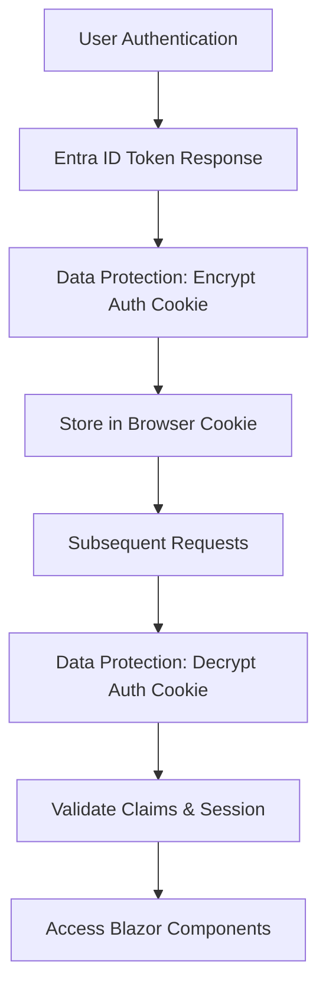

# Advanced Security Addendum: Scopes, Claims, and Token Behavior in Blazor Server

This document serves as a **security addendum** to the main article "[Scopes, Claims, and Token Behavior in Blazor Server with Entra ID and Microsoft Graph](./scopes-claims-blazor.md)". It covers advanced security topics and implementation patterns that extend beyond the foundational concepts discussed in the original document.

_**WARNING**: This addendum was written by AI and has yet to be fully vetted._

**Prerequisites**: This addendum assumes familiarity with the concepts, configurations, and patterns covered in the main document, particularly the sections on token types, MSAL configuration, and WSO2 API Manager integration.

<!-- more -->

## Continuous Access Evaluation (CAE) Implementation

Building upon the token validation concepts discussed in the original document, **Continuous Access Evaluation (CAE)** provides real-time security policy enforcement that goes beyond traditional token expiration.

### Understanding CAE in the Blazor Server Context

As covered in the main document's token lifecycle section, traditional access tokens have fixed expiration times. CAE enhances this by enabling immediate token revocation based on critical security events:

- **User account disabled/deleted**
- **Password changes**
- **High-risk sign-in detection**
- **Location-based policy violations**

### CAE Configuration for Blazor Server

Extending the MSAL configuration shown in the original document:

```csharp
// Building upon the original AddMicrosoftIdentityWebApp configuration
builder.Services.AddAuthentication(OpenIdConnectDefaults.AuthenticationScheme)
    .AddMicrosoftIdentityWebApp(options =>
    {
        builder.Configuration.GetSection("AzureAd").Bind(options);
        options.UsePkce = true;
        options.SaveTokens = false;
        
        // CAE-specific configuration
        options.Events.OnTokenValidated = async context =>
        {
            // Enable CAE claims processing
            var identity = (ClaimsIdentity)context.Principal!.Identity!;
            if (identity.HasClaim("xms_cc", "cp1"))
            {
                // Token supports CAE - log for monitoring
                var logger = context.HttpContext.RequestServices
                    .GetRequiredService<ILogger<Program>>();
                logger.LogInformation("CAE-enabled token received for user {UserId}", 
                    identity.FindFirst("sub")?.Value);
            }
        };
    })
    .EnableTokenAcquisitionToCallDownstreamApi(options =>
    {
        // Request CAE-capable tokens
        options.LongRunningWebApi = true; // Enables CAE support
    }, new[] { "User.Read", "Mail.Read" })
    .AddMicrosoftGraph(builder.Configuration.GetSection("Graph"))
    .AddDistributedTokenCaches();
```

### CAE-Aware Component Implementation

Extending the GraphComponent pattern from the original document:

```csharp
[AuthorizeForScopes(Scopes = new[] { "User.Read" })]
public class CAEAwareGraphComponent : ComponentBase
{
    [Inject] GraphServiceClient GraphClient { get; set; } = default!;
    [Inject] ILogger<CAEAwareGraphComponent> Logger { get; set; } = default!;
    
    private string? displayName;
    private bool isCaeEnabled;
    
    protected override async Task OnInitializedAsync()
    {
        try
        {
            // Check if current token supports CAE
            var authState = await AuthenticationStateProvider.GetAuthenticationStateAsync();
            isCaeEnabled = authState.User.HasClaim("xms_cc", "cp1");
            
            var me = await GraphClient.Me.Request().GetAsync();
            displayName = me.DisplayName;
            
            Logger.LogInformation("Profile loaded with CAE support: {CaeEnabled}", isCaeEnabled);
        }
        catch (ServiceException ex) when (ex.Error?.Code == "InvalidAuthenticationToken")
        {
            // CAE may have revoked the token - handle gracefully
            Logger.LogWarning("Token revoked via CAE for user session");
            await HandleTokenRevocation();
        }
    }
    
    private async Task HandleTokenRevocation()
    {
        // Implement CAE token revocation handling
        displayName = "Session expired - please sign in again";
        // Optionally trigger re-authentication
    }
}
```

### CAE Integration with WSO2 API Manager

Referencing the WSO2 integration patterns from the original document, CAE requires additional gateway configuration:

```yaml
# WSO2 APIM CAE Configuration Extension
[apim.oauth_config]
enable_cae_validation = true
cae_endpoint = "https://login.microsoftonline.com/{tenant}/oauth2/v2.0/cae"

[apim.jwt_config]
# Validate CAE claims in JWT tokens
required_claims = ["xms_cc", "xms_tcdt"]
```

## Proof of Possession (PoP) Token Implementation

While the original document covers standard bearer tokens, **Proof of Possession (PoP) tokens** provide enhanced security by cryptographically binding tokens to specific clients.

### When to Implement PoP Tokens

PoP tokens should be considered for:
- **High-value API operations** (financial transactions, sensitive data access)
- **Zero Trust architecture** implementations
- **Compliance requirements** (PCI DSS, FIDO2)

### PoP Token Configuration

Extending the token acquisition patterns from the main document:

```csharp
// Enhanced token acquisition with PoP support
public class PopTokenService
{
    private readonly ITokenAcquisition _tokenAcquisition;
    private readonly ILogger<PopTokenService> _logger;
    
    public PopTokenService(ITokenAcquisition tokenAcquisition, ILogger<PopTokenService> logger)
    {
        _tokenAcquisition = tokenAcquisition;
        _logger = logger;
    }
    
    public async Task<string> AcquirePopTokenAsync(string[] scopes, string httpMethod, string url)
    {
        try
        {
            // Generate key pair for PoP
            using var rsa = RSA.Create(2048);
            var publicKey = Convert.ToBase64String(rsa.ExportRSAPublicKey());
            
            // Create PoP token request
            var popTokenRequest = new AuthenticationRequestParameters
            {
                Scopes = scopes,
                ExtraQueryParameters = new Dictionary<string, string>
                {
                    ["token_type"] = "pop",
                    ["req_cnf"] = CreateConfirmationClaim(publicKey, httpMethod, url)
                }
            };
            
            var result = await _tokenAcquisition.GetAccessTokenForUserAsync(
                scopes, 
                authenticationScheme: OpenIdConnectDefaults.AuthenticationScheme);
                
            _logger.LogInformation("PoP token acquired for scopes: {Scopes}", string.Join(", ", scopes));
            return result;
        }
        catch (Exception ex)
        {
            _logger.LogError(ex, "Failed to acquire PoP token");
            throw;
        }
    }
    
    private string CreateConfirmationClaim(string publicKey, string httpMethod, string url)
    {
        var confirmation = new
        {
            jwk = new
            {
                kty = "RSA",
                n = publicKey,
                e = "AQAB"
            },
            htm = httpMethod,
            htu = url,
            jti = Guid.NewGuid().ToString()
        };
        
        return Convert.ToBase64String(Encoding.UTF8.GetBytes(JsonSerializer.Serialize(confirmation)));
    }
}
```

### PoP Token Usage in Components

```csharp
[AuthorizeForScopes(Scopes = new[] { "https://graph.microsoft.com/Mail.Read" })]
public class PopEnabledMailComponent : ComponentBase
{
    [Inject] PopTokenService PopTokenService { get; set; } = default!;
    [Inject] HttpClient HttpClient { get; set; } = default!;
    
    private async Task<string> CallGraphWithPopToken()
    {
        var scopes = new[] { "https://graph.microsoft.com/Mail.Read" };
        var url = "https://graph.microsoft.com/v1.0/me/messages";
        
        // Acquire PoP token bound to this specific request
        var popToken = await PopTokenService.AcquirePopTokenAsync(scopes, "GET", url);
        
        // Use PoP token in Authorization header
        HttpClient.DefaultRequestHeaders.Authorization = 
            new System.Net.Http.Headers.AuthenticationHeaderValue("PoP", popToken);
            
        var response = await HttpClient.GetAsync(url);
        return await response.Content.ReadAsStringAsync();
    }
}
```

## Cookie Security and ASP.NET Core Data Protection

Complementing the authentication configuration covered in the original document, proper cookie security and data protection are critical for Blazor Server applications.

### Understanding ASP.NET Core Data Protection

**What is Data Protection?**
The ASP.NET Core Data Protection API provides a simple, easy-to-use cryptographic API that applications can use to protect data, including temporary data that should not be persisted forever. It's designed to serve as the replacement for the `<machineKey>` element in ASP.NET 1.x - 4.x.

**Why is Data Protection Critical for Blazor Server + Entra ID?**

In the context of Blazor Server applications with Entra ID authentication, Data Protection is essential for several security-critical scenarios:

1. **Authentication Cookie Protection**: As discussed in the original document's authentication flow, Blazor Server maintains user sessions through authentication cookies. These cookies contain sensitive authentication state that must be encrypted and tamper-proof.

2. **Anti-Forgery Token Security**: Blazor Server uses anti-forgery tokens to prevent CSRF attacks on SignalR connections. These tokens must be cryptographically secure and validated.

3. **Sensitive Claims Storage**: When using `IClaimsTransformation` (covered in the original document), transformed claims may need temporary encrypted storage to prevent tampering.

4. **Circuit State Protection**: Blazor Server maintains user state in server-side circuits. Sensitive data within these circuits requires protection when serialized or cached.

5. **Token Cache Encryption**: While the original document shows `.AddInMemoryTokenCaches()`, production environments often require encrypted token storage across multiple server instances.

**Security Risks Without Proper Data Protection:**
- **Session Hijacking**: Unprotected authentication cookies can be stolen and replayed
- **Claims Tampering**: Modified claims could lead to privilege escalation
- **Cross-Site Request Forgery**: Weak anti-forgery tokens compromise SignalR security
- **Data Leakage**: Unencrypted sensitive data in logs, memory dumps, or storage

### Data Protection Architecture in Blazor Server

**Key Components:**
- **Key Ring**: Manages encryption keys with automatic rotation
- **Data Protectors**: Provide purpose-specific encryption/decryption
- **Key Escrow**: Enables key recovery for compliance scenarios
- **Persistence Layer**: Stores keys securely across application restarts

**Integration with Entra ID Authentication Flow:**


### Enhanced Cookie Security Configuration

Building upon the basic authentication setup from the main document:

```csharp
// Enhanced cookie security configuration
builder.Services.ConfigureApplicationCookie(options =>
{
    // Security headers
    options.Cookie.SecurePolicy = CookieSecurePolicy.Always;
    options.Cookie.SameSite = SameSiteMode.Strict;
    options.Cookie.HttpOnly = true;
    options.Cookie.IsEssential = true;
    
    // Timing configuration
    options.ExpireTimeSpan = TimeSpan.FromHours(1);
    options.SlidingExpiration = true;
    options.AccessDeniedPath = "/Account/AccessDenied";
    options.LoginPath = "/Account/SignIn";
    
    // Enhanced security events
    options.Events.OnValidatePrincipal = async context =>
    {
        // Validate security stamp for immediate logout on password change
        var securityStampValidator = context.HttpContext.RequestServices
            .GetRequiredService<ISecurityStampValidator>();
        await securityStampValidator.ValidateAsync(context);
    };
});
```

### Data Protection API Configuration

**Development Environment Configuration:**
```csharp
// Development - keys stored locally
if (builder.Environment.IsDevelopment())
{
    builder.Services.AddDataProtection()
        .PersistKeysToFileSystem(new DirectoryInfo(@".\keys"))
        .SetApplicationName("BlazorServerApp-Dev");
}
```

**Production Environment Configuration:**
```csharp
// Production - enterprise-grade key management
if (builder.Environment.IsProduction())
{
    builder.Services.AddDataProtection()
        // Persist keys to Azure Blob Storage for multi-instance deployments
        .PersistKeysToAzureBlobStorage(connectionString, containerName, blobName)

        // Protect keys with Azure Key Vault HSM
        .ProtectKeysWithAzureKeyVault(keyVaultUri, keyName)

        // Application isolation - critical for multi-tenant scenarios
        .SetApplicationName("BlazorServerApp-Prod")

        // Key rotation policy - balance security vs performance
        .SetDefaultKeyLifetime(TimeSpan.FromDays(90))

        // Compliance requirement - key escrow for data recovery
        .AddKeyEscrowSink<CustomKeyEscrowSink>()

        // Additional security - require authentication for key access
        .AddKeyManagementOptions(options =>
        {
            options.AuthenticatedEncryptorConfiguration = new AuthenticatedEncryptorConfiguration
            {
                EncryptionAlgorithm = EncryptionAlgorithm.AES_256_CBC,
                ValidationAlgorithm = ValidationAlgorithm.HMACSHA256
            };
        });
}

// Custom data protection for sensitive claims
builder.Services.AddSingleton<IClaimsProtectionService, ClaimsProtectionService>();
```

**Why These Configuration Choices Matter:**

1. **Azure Blob Storage Persistence**: Ensures keys are available across multiple server instances, preventing authentication failures during deployments or scaling events.

2. **Azure Key Vault Protection**: Hardware Security Module (HSM) protection for master keys, meeting compliance requirements for financial and healthcare applications.

3. **Application Name Isolation**: Prevents key sharing between different applications or environments, critical for multi-tenant scenarios.

4. **90-Day Key Lifetime**: Balances security (regular key rotation) with performance (reduces key generation overhead).

5. **Key Escrow**: Enables data recovery for compliance scenarios while maintaining security.

### Secure Claims Protection Service

**Purpose**: Extends the `IClaimsTransformation` pattern from the original document by providing encrypted storage for sensitive claims that need to persist beyond the immediate authentication context.

**Use Cases:**
- Caching expensive claims transformations (e.g., role lookups from external systems)
- Storing sensitive user attributes that shouldn't appear in plain text logs
- Protecting claims during circuit serialization in Blazor Server

```csharp
public interface IClaimsProtectionService
{
    string ProtectClaims(ClaimsPrincipal principal);
    ClaimsPrincipal UnprotectClaims(string protectedClaims);
    Task<string> ProtectClaimsWithExpirationAsync(ClaimsPrincipal principal, TimeSpan expiration);
    Task<ClaimsPrincipal?> UnprotectClaimsWithExpirationAsync(string protectedClaims);
}

public class ClaimsProtectionService : IClaimsProtectionService
{
    private readonly IDataProtector _protector;
    private readonly IDataProtector _timedProtector;
    private readonly ILogger<ClaimsProtectionService> _logger;

    public ClaimsProtectionService(IDataProtectionProvider provider, ILogger<ClaimsProtectionService> logger)
    {
        // Purpose-specific protectors for different claim scenarios
        _protector = provider.CreateProtector("ClaimsProtection.v1");
        _timedProtector = provider.CreateProtector("ClaimsProtection.Timed.v1").ToTimeLimitedDataProtector();
        _logger = logger;
    }

    public string ProtectClaims(ClaimsPrincipal principal)
    {
        try
        {
            // Filter sensitive claims - don't protect system claims
            var protectableClaims = principal.Claims
                .Where(c => !IsSystemClaim(c.Type))
                .Select(c => new ClaimData { Type = c.Type, Value = c.Value })
                .ToArray();

            var claimsPackage = new ProtectedClaimsPackage
            {
                Claims = protectableClaims,
                UserId = principal.FindFirst("sub")?.Value,
                IssuedAt = DateTimeOffset.UtcNow,
                AuthenticationType = principal.Identity?.AuthenticationType
            };

            var json = JsonSerializer.Serialize(claimsPackage);
            var protectedData = _protector.Protect(json);

            _logger.LogDebug("Protected {ClaimCount} claims for user {UserId}",
                protectableClaims.Length, claimsPackage.UserId);

            return protectedData;
        }
        catch (Exception ex)
        {
            _logger.LogError(ex, "Failed to protect claims");
            throw;
        }
    }

    public ClaimsPrincipal UnprotectClaims(string protectedClaims)
    {
        try
        {
            var json = _protector.Unprotect(protectedClaims);
            var claimsPackage = JsonSerializer.Deserialize<ProtectedClaimsPackage>(json);

            if (claimsPackage?.Claims == null)
            {
                throw new InvalidOperationException("Invalid claims package");
            }

            var claims = claimsPackage.Claims.Select(c => new Claim(c.Type, c.Value));
            var identity = new ClaimsIdentity(claims, claimsPackage.AuthenticationType ?? "DataProtection");

            _logger.LogDebug("Unprotected {ClaimCount} claims for user {UserId}",
                claimsPackage.Claims.Length, claimsPackage.UserId);

            return new ClaimsPrincipal(identity);
        }
        catch (Exception ex)
        {
            _logger.LogError(ex, "Failed to unprotect claims");
            throw;
        }
    }

    public async Task<string> ProtectClaimsWithExpirationAsync(ClaimsPrincipal principal, TimeSpan expiration)
    {
        // Implementation for time-limited claim protection
        var claimsData = ProtectClaims(principal);
        return _timedProtector.Protect(claimsData, expiration);
    }

    public async Task<ClaimsPrincipal?> UnprotectClaimsWithExpirationAsync(string protectedClaims)
    {
        try
        {
            var claimsData = _timedProtector.Unprotect(protectedClaims);
            return UnprotectClaims(claimsData);
        }
        catch (CryptographicException)
        {
            // Time-limited protection expired
            _logger.LogInformation("Time-limited claims protection expired");
            return null;
        }
    }

    private bool IsSystemClaim(string claimType)
    {
        // Don't protect system/infrastructure claims
        var systemClaims = new[] { "iss", "aud", "exp", "iat", "nbf", "sub", "jti" };
        return systemClaims.Contains(claimType);
    }
}

// Supporting data structures
public class ProtectedClaimsPackage
{
    public ClaimData[] Claims { get; set; } = Array.Empty<ClaimData>();
    public string? UserId { get; set; }
    public DateTimeOffset IssuedAt { get; set; }
    public string? AuthenticationType { get; set; }
}

public class ClaimData
{
    public string Type { get; set; } = string.Empty;
    public string Value { get; set; } = string.Empty;
}
```

**Integration with Claims Transformation:**
```csharp
// Enhanced claims transformer using data protection
public class SecureClaimsTransformer : IClaimsTransformation
{
    private readonly IClaimsProtectionService _claimsProtection;
    private readonly IMemoryCache _cache;

    public async Task<ClaimsPrincipal> TransformAsync(ClaimsPrincipal principal)
    {
        var userId = principal.FindFirst("sub")?.Value;
        if (userId == null) return principal;

        // Check for cached protected claims
        var cacheKey = $"protected_claims_{userId}";
        if (_cache.TryGetValue(cacheKey, out string? cachedProtectedClaims))
        {
            var cachedPrincipal = await _claimsProtection.UnprotectClaimsWithExpirationAsync(cachedProtectedClaims);
            if (cachedPrincipal != null)
            {
                return MergeClaims(principal, cachedPrincipal);
            }
        }

        // Perform expensive claims transformation
        var transformedPrincipal = await PerformExpensiveClaimsLookup(principal);

        // Cache the protected claims
        var protectedClaims = await _claimsProtection.ProtectClaimsWithExpirationAsync(
            transformedPrincipal, TimeSpan.FromMinutes(15));
        _cache.Set(cacheKey, protectedClaims, TimeSpan.FromMinutes(15));

        return transformedPrincipal;
    }
}
```

## Integration with Original Document Patterns

### Enhanced Security Headers Middleware

Extending the security considerations from the main document:

```csharp
// Comprehensive security headers for Blazor Server
app.Use(async (context, next) =>
{
    var headers = context.Response.Headers;
    
    // Basic security headers
    headers.Add("X-Frame-Options", "DENY");
    headers.Add("X-Content-Type-Options", "nosniff");
    headers.Add("Referrer-Policy", "strict-origin-when-cross-origin");
    
    // Enhanced CSP for Blazor Server with SignalR
    headers.Add("Content-Security-Policy", 
        "default-src 'self'; " +
        "script-src 'self' 'unsafe-inline' 'unsafe-eval'; " +
        "style-src 'self' 'unsafe-inline'; " +
        "connect-src 'self' wss: https:; " +
        "img-src 'self' data: https:;");
    
    // HSTS for production
    if (app.Environment.IsProduction())
    {
        headers.Add("Strict-Transport-Security", "max-age=31536000; includeSubDomains");
    }
    
    await next();
});
```

### WSO2 Integration with Advanced Security

Extending the WSO2 patterns from the original document:

```yaml
# Enhanced WSO2 configuration for advanced security features
[apim.oauth_config]
enable_pop_validation = true
enable_cae_validation = true
token_binding_validation = true

[apim.security]
enable_mtls = true
client_certificate_validation = true
```

## Monitoring and Compliance

### Security Event Logging

```csharp
// Enhanced logging for security events
public class SecurityEventLogger
{
    private readonly ILogger<SecurityEventLogger> _logger;
    
    public void LogTokenAcquisition(string userId, string[] scopes, bool caeEnabled, bool popEnabled)
    {
        _logger.LogInformation("Token acquired - User: {UserId}, Scopes: {Scopes}, CAE: {CaeEnabled}, PoP: {PopEnabled}",
            userId, string.Join(",", scopes), caeEnabled, popEnabled);
    }
    
    public void LogSecurityViolation(string userId, string violation, string details)
    {
        _logger.LogWarning("Security violation - User: {UserId}, Violation: {Violation}, Details: {Details}",
            userId, violation, details);
    }
}
```

## Summary

This addendum extends the foundational security concepts from the main document with advanced implementation patterns for:

- **Continuous Access Evaluation** for real-time policy enforcement
- **Proof of Possession tokens** for enhanced API security
- **Cookie security and Data Protection** for comprehensive application security

These patterns should be implemented based on your specific security requirements and compliance needs, building upon the solid foundation established in the original document's authentication and authorization patterns.

---

## See Also

### Related Documentation
- **[Main Article]**: [Scopes, Claims, and Token Behavior in Blazor Server with Entra ID and Microsoft Graph](./scopes-claims-blazor.md) - Foundational concepts and basic implementation patterns
- **Microsoft Learn**: [Threat mitigation guidance for ASP.NET Core Blazor interactive server-side rendering](https://learn.microsoft.com/en-us/aspnet/core/blazor/security/interactive-server-side-rendering)
- **Microsoft Learn**: [Configure JWT bearer authentication in ASP.NET Core](https://learn.microsoft.com/en-us/aspnet/core/security/authentication/configure-jwt-bearer-authentication)

### Advanced Security Resources
- **OWASP**: [.NET Security Cheat Sheet](https://cheatsheetseries.owasp.org/cheatsheets/DotNet_Security_Cheat_Sheet.html)
- **Microsoft Security**: [Zero Trust security model](https://www.microsoft.com/en-us/security/business/zero-trust)
- **NIST**: [Cybersecurity Framework](https://www.nist.gov/cyberframework)

## Citations and References

### Microsoft Official Documentation
1. **Microsoft Learn** - "Continuous Access Evaluation in Microsoft Entra ID" - [https://learn.microsoft.com/en-us/entra/identity/conditional-access/concept-continuous-access-evaluation](https://learn.microsoft.com/en-us/entra/identity/conditional-access/concept-continuous-access-evaluation)
2. **Microsoft Learn** - "Microsoft identity platform and OAuth 2.0 authorization code flow" - [https://learn.microsoft.com/en-us/entra/identity-platform/v2-oauth2-auth-code-flow](https://learn.microsoft.com/en-us/entra/identity-platform/v2-oauth2-auth-code-flow)
3. **Microsoft Learn** - "Acquire and cache tokens with Microsoft Authentication Library (MSAL)" - [https://learn.microsoft.com/en-us/entra/identity-platform/msal-acquire-cache-tokens](https://learn.microsoft.com/en-us/entra/identity-platform/msal-acquire-cache-tokens)
4. **Microsoft Learn** - "Data Protection in ASP.NET Core" - [https://learn.microsoft.com/en-us/aspnet/core/security/data-protection/](https://learn.microsoft.com/en-us/aspnet/core/security/data-protection/)

### Security Standards and Specifications
5. **RFC 7800** - "Proof-of-Possession Key Semantics for JSON Web Tokens (JWTs)" - [https://tools.ietf.org/html/rfc7800](https://tools.ietf.org/html/rfc7800)
6. **RFC 8705** - "OAuth 2.0 Mutual-TLS Client Authentication and Certificate-Bound Access Tokens" - [https://tools.ietf.org/html/rfc8705](https://tools.ietf.org/html/rfc8705)
7. **OWASP Top 10** - "Web Application Security Risks" - [https://owasp.org/www-project-top-ten/](https://owasp.org/www-project-top-ten/)

### Implementation Guidance Sources
8. **Microsoft Security Blog** - "Continuous Access Evaluation: A new security paradigm" - Referenced for CAE implementation patterns
9. **ASP.NET Core Security Documentation** - Cookie security and authentication configuration patterns
10. **WSO2 Documentation** - "API Manager Security" - Integration patterns for enterprise API gateways

### Research and Analysis Sources
11. **GitHub Issues** - dotnet/aspnetcore repository - Blazor Server security discussions and threat mitigation guidance
12. **Microsoft Security Response Center** - Security advisories and vulnerability disclosures for .NET applications
13. **NIST Special Publication 800-63B** - "Authentication and Lifecycle Management" - Multi-factor authentication and token binding guidance

## Disclaimer

**Important Note**: The code examples and configuration patterns in this addendum are based on current Microsoft documentation, security best practices, and established standards as of August 2025. However, some advanced implementation details (particularly around PoP token generation and CAE event handling) represent recommended patterns that should be validated against the latest Microsoft documentation and tested thoroughly in your specific environment.

**Security Recommendation**: Always consult the latest official Microsoft documentation and conduct security testing before implementing these patterns in production environments. Security requirements and implementation details may vary based on your specific compliance, regulatory, and organizational security policies.

---

📌 **Next Steps**: Review your current implementation against these advanced patterns and implement them incrementally based on your security posture requirements and compliance obligations.
