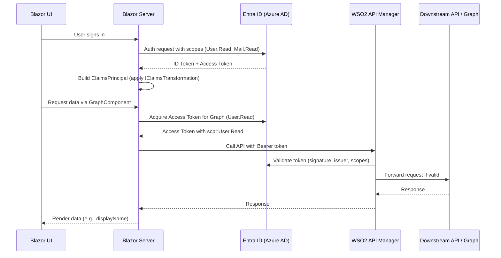

# Scopes, Claims, and Token Behavior in Blazor Server with Entra ID and Microsoft Graph

This document provides a detailed explanation of **scopes**, **claims**, and **tokens** in a **Blazor Server application** integrated with **Microsoft Entra ID (Azure AD)** and **Microsoft Graph**. It also covers their behavioral effects when APIs are accessed via a **gateway**, and explains the role of the **issuer** and **authority**. This guidance is intended for technical IT staff including project managers, architects, security teams, and lead developers.

<!-- more -->

## Scopes vs Claims

### Scopes (Permissions)

- **Definition**: Scopes represent **what an application is allowed to do**.
- **Where used**: Requested during token acquisition and validated by the API or gateway.
- **Behavioral effect**:
  - They appear in the **access token** as the `scp` claim.
  - APIs enforce scopes to decide if a request is authorized.
- **Example**:
  ```json
  "scp": "User.Read Mail.Read"
  ```
  This means the token holder can read profile info and email.

### Claims (Identity Attributes)
- **Definition**: Claims describe **who the user is** and additional attributes.
- **Where used**: Issued in **ID tokens** and **access tokens**.
- **Behavioral effect**:
  - Claims affect application logic (e.g., roles, display name, tenant ID).
  - They do **not** change what APIs you can call (that is scope-driven).

**Example claims in an ID token:**
```json
{
  "name": "Alice Example",
  "preferred_username": "alice@contoso.com",
  "roles": ["Admin", "User"],
  "iss": "https://login.microsoftonline.com/{tenantId}/v2.0"
}
```

## Token Types and Their Purpose

### ID Token
- Confirms **who the user is**.
- Contains claims used for personalization and authorization inside Blazor.
- Not used when calling APIs.

### Access Token
- Confirms **what the client app is allowed to do**.
- Contains `scp` claim (scopes) and some identity claims.
- Sent in the `Authorization: Bearer <token>` header when calling Microsoft Graph or your APIs.

### Refresh Token
- Used to silently request new access tokens when old ones expire.
- Managed automatically by MSAL in Blazor with `.AddInMemoryTokenCaches()`.
- Not sent to your APIs.

## How `IClaimsTransformation` Fits In

- Runs **after authentication** to transform the in-app `ClaimsPrincipal`.
- **Does not** modify the actual ID token or access token issued by Entra.
- Useful for mapping Entra claims (e.g., `groups`) into app-specific roles.

Example:
```csharp
public class CustomClaimsTransformer : IClaimsTransformation
{
    public Task<ClaimsPrincipal> TransformAsync(ClaimsPrincipal principal)
    {
        var identity = (ClaimsIdentity)principal.Identity!;
        if (identity.HasClaim(c => c.Type == "groups" && c.Value == "group-id-here"))
        {
            identity.AddClaim(new Claim(ClaimTypes.Role, "FinanceAdmin"));
        }
        return Task.FromResult(principal);
    }
}
```

👉 This affects only Blazor’s local authorization checks, not downstream API calls.

## Authority and Issuer

- **Authority**: URL MSAL uses to authenticate and request tokens.
  ```json
  "Authority": "https://login.microsoftonline.com/{tenantId}/v2.0"
  ```
  - Provides metadata endpoints (keys, discovery, etc.).
  - Defines the tenant/policy for authentication.

- **Issuer (`iss`) claim**: Inside tokens, confirms who issued the token.
  ```json
  "iss": "https://login.microsoftonline.com/contosoTenantId/v2.0"
  ```
  - APIs and gateways validate that the `iss` matches the configured authority.
  - Prevents tokens from other tenants/issuers being accepted.

## Example Configuration and Flow in Blazor

**Startup configuration:**
```csharp
builder.Services.AddAuthentication(OpenIdConnectDefaults.AuthenticationScheme)
    .AddMicrosoftIdentityWebApp(builder.Configuration.GetSection("AzureAd"))
    .EnableTokenAcquisitionToCallDownstreamApi(new[] { "User.Read", "Mail.Read" })
    .AddMicrosoftGraph(builder.Configuration.GetSection("Graph"))
    .AddInMemoryTokenCaches();
```

**Component requiring Graph permissions:**
```csharp
[AuthorizeForScopes(Scopes = new[] { "User.Read" })]
public class GraphComponent : ComponentBase
{
    [Inject]
    GraphServiceClient GraphClient { get; set; } = default!;

    private string? displayName;

    protected override async Task OnInitializedAsync()
    {
        var me = await GraphClient.Me.Request().GetAsync();
        displayName = me.DisplayName;
    }
}
```

Behavior:
- `[AuthorizeForScopes]` ensures the access token in cache has `User.Read`.
- If not, MSAL requests a new access token with the required scope.
- Access token is **not altered** by claim transformations.

## Sequence Diagram: Authentication and API Call Flow



## Additional Considerations with WSO2 API Manager

When using **WSO2 API Manager (APIM)** as the gateway:

### Token Validation in WSO2

- WSO2 expects **self-contained JWT access tokens**.
- Validates:
  - **Signature** against trusted public keys.
  - **Standard claims** (`iss`, `sub`, `exp`, `iat`).
  - **Scopes** (`scp` or `scope`) for API access.

### Claim Mapping and Scope Translation

- Entra tokens use `scp` for scopes; WSO2 may expect `scope`.
- Use **claim mapping** in WSO2 to align claims.
- Scope enforcement is configurable per API definition.

### Azure AD Integration

- Azure AD is **not natively supported** as a WSO2 Key Manager.
- Options:
  - Implement a **custom key manager** in WSO2 to validate Entra tokens directly.
  - Or use a **token exchange flow** (exchange Entra-issued token for a WSO2-recognized token).

### Claim-Based Access Policies

- WSO2 supports **JWT claim-based access validators**.
- You can enforce policies like:
  - Restrict access to users from specific tenant IDs.
  - Require a role claim (e.g., `roles: Admin`).

### Backend Authentication

- WSO2 can manage its own OAuth2 credentials when authenticating to backends.
- Use **OAuth2 endpoint security** with grant types such as client credentials.
- Supports **Redis caching** for OAuth state across distributed gateways.

### Scope Allowlisting

- Certain scopes can be allowlisted to bypass role checks.
- Configure allowlisting in `deployment.toml` if some scopes should always pass validation.

## Security Best Practices

1. **Request least-privilege scopes** – never ask for more than you need.
2. **Enforce scope checks at WSO2 gateway/API** using the `scp` or `scope` claim.
3. **Use claims transformations only locally** – do not rely on them for API security.
4. **Validate issuer and audience** in every API/gateway.
5. **Rely on MSAL for token refresh and caching** – do not store tokens manually.
6. **Use `[AuthorizeForScopes]`** to ensure tokens have necessary permissions before API calls.
7. **Configure WSO2** to:
   - Trust Entra public signing keys.
   - Map claims as needed (e.g., `scp` → `scope`).
   - Enforce claim-based access control for sensitive APIs.

## Key Takeaways
- **Scopes = Permissions** (what you can do, validated by APIs/gateway).
- **Claims = Identity attributes** (who you are, used by apps for authorization/UI).
- **ID Token** = Establishes user identity.
- **Access Token** = Grants permissions to call APIs.
- **Refresh Token** = Silently gets new access tokens.
- **Claims transformations** only affect **local app logic**, not tokens sent downstream.
- **Authority/Issuer** ensure tokens are trusted and from the correct tenant.
- **WSO2 APIM** must be configured to:
  - Accept and validate Entra-issued JWTs.
  - Enforce scopes and claims consistently.
  - Optionally use token exchange or custom key manager if Entra tokens are not directly consumable.

---

📌 By clearly separating **scope enforcement** (at WSO2 gateway/API) from **claims usage** (inside Blazor) and understanding token lifecycles, you can build secure Blazor Server applications aligned with enterprise security policies.
